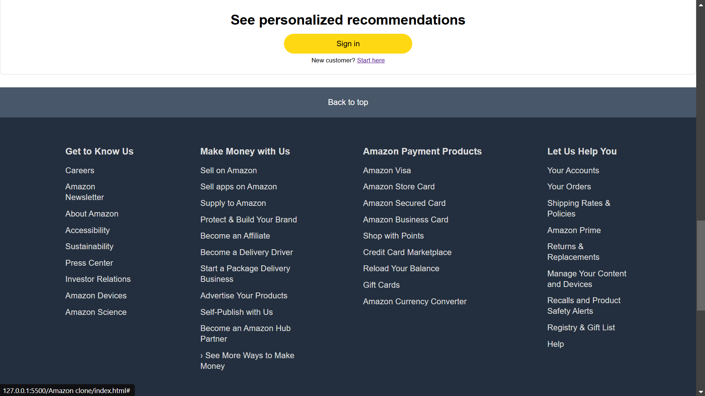

# Amazon Clone Website

A simple Amazon clone website built using HTML and CSS.

## Features
- Amazon-like homepage layout
- Details and effects
- Navigation bar with search bar
- Product listings with images and descriptions
- Footer with links

## Technologies Used
- **HTML5**: Structure of the website
- **CSS3**: Styling and responsiveness

## Installation & Usage
1. Clone the repository:
   ```sh
   git clone https://github.com/nishchyapratapsingh/WebDev.git

   ```
2. Navigate to the project folder:
   ```sh
   cd WebDev/CSS/Amazon\ clone
   ```
3. Open `index.html` in your browser.

## Live Demo 🚀  
Check out the live version of this project here:  

🔗 [Amazon Clone on Vercel](https://amazonclone-nps.vercel.app/)


## Screenshots





## Future Enhancements
- Add JavaScript for interactive elements
- Improvement in responsiveness of website

## Contributing
Feel free to fork this repository and contribute by submitting a pull request.

## License
This project is open-source and available under the MIT License.

---
Made with ❤️ by [Nishchya Singh](https://github.com/nishchyapratapsingh)

