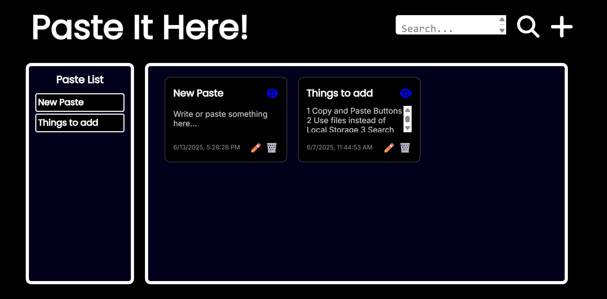

# 📋 Paste It Here

**Paste It Here** is a simple, minimalistic clipboard-style notes app that lets you quickly paste, edit, and copy text. Ideal for quick thoughts, links, or temporary notes.

## 🚀 Features

- 📝 Paste and edit text easily
- 📋 One-click copy to clipboard
- 💡 Clean, user-friendly interface
- 💻 Works on desktop and mobile

## 🛠️ Tech Stack

- HTML5, CSS3, JavaScript
- (Optional) React (if applicable)

## 📦 How to Use

1. Clone the repo:
   ````
   git clone https://github.com/your-username/paste-it-here.git
   cd paste-it-here
````

2. Open `index.html` in your browser (or run a live server if using React).

3. Start pasting and managing your text!

## 📷 Screenshots



## ✨ Try it out on Vercel
[Paste It Here on Vercel](https://paste-it-here.vercel.app/)

## ✨ Future Ideas

* Dark mode toggle
* Search feature
* Cloud backup (Google Drive, Firebase)
* Password-protected notes

## 📄 License

This project is open-source under the [MIT License](LICENSE).

---

**Made with ❤️ by [Nishchya Pratap Singh](https://github.com/nishchyapratapsingh)**

